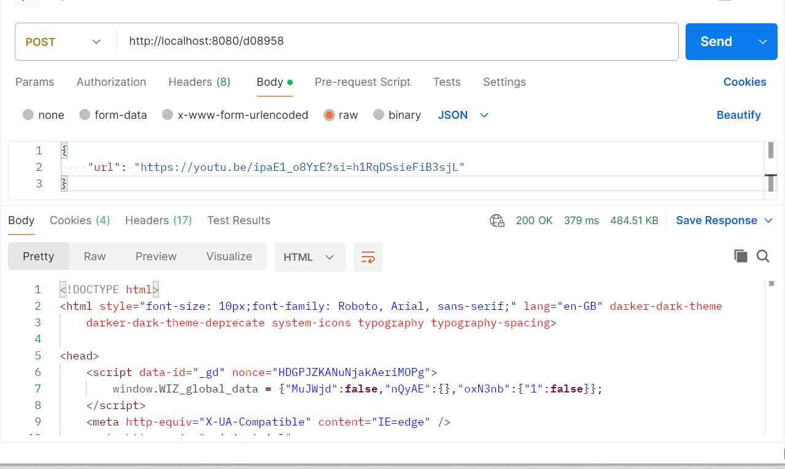
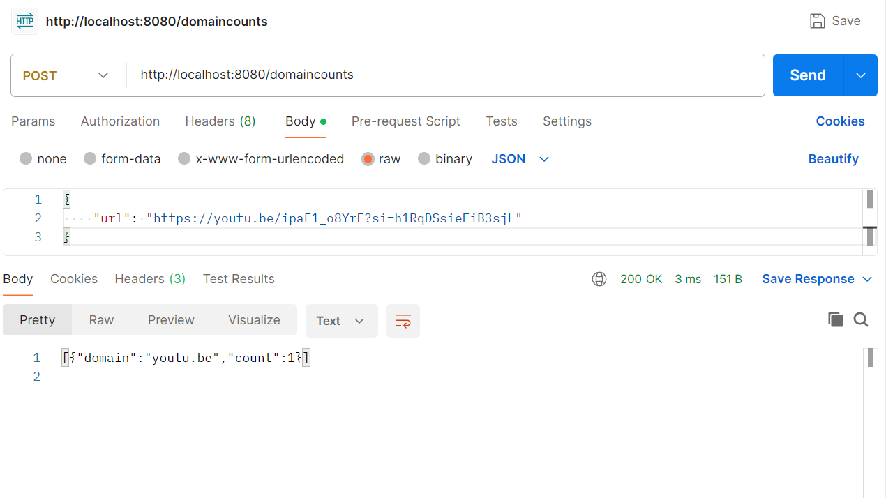

# url-shortner
Clone the repository and build it using go build command run the executable file url-shortner as 
```
go build
./url-shortner
```
To get the shortened url , you can use the postman api tool or can use the curl command in Linux like 
```
curl -X POST -H "Content-Type: application/json" -d '{"url":"https://youtu.be/ipaE1_o8YrE?si=h1RqDSsieFiB3sjL"}' http://localhost:8080/shorten
```


To Redirect the url , use the api response getting from the above api and use it as 
```
curl -L http://localhost:8080/d08958
```


To check the top 3 domains use the below as as
```
curl -L http://localhost:8080/domaincounts
```
