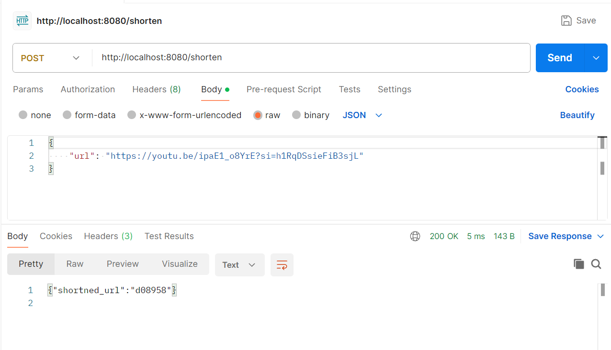

# url-shortner
Clone the repository and run the executable file url-shortner as 
```
./url-shortner

To get the shortened url , you can use the postman api tool or can use the curl command in Linux like 
```
curl -X POST -H "Content-Type: application/json" -d '{"url":"https://google.com"}' http://localhost:8080/shorten

